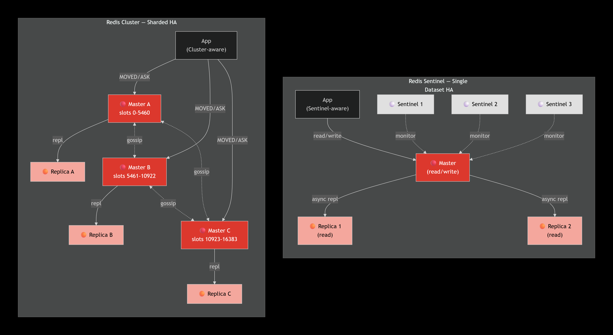

# Redis Security Hardening

Complete documentation set for Redis security hardening across Glynac deployments.

**Ticket:** DEV-587 — Redis Security Hardening
**Prepared by:** Thanusha Bai V
**Department:** DevOps
**Date:** September 2026

---

## Table of Contents

1. [Overview](#overview)
2. [Reports](#reports)
3. [Scripts](#scripts)
4. [Diagrams](#diagrams)
5. [Repository Structure](#repository-structure)
6. [Subtask Summary](#subtask-summary)
7. [Key Findings](#key-findings)
8. [Usage Notes](#usage-notes)
9. [License](#license)

---

## Overview

This repository contains the complete Redis security hardening documentation produced under DEV-587. It covers authentication, ACL-based access control, network binding, persistence configuration, high availability, backup and restore procedures, monitoring, and a consolidated security checklist.

All practical subtasks were validated live against a **Redis 8.10.1** reference instance. Test outputs are captured verbatim in each PDF report.

---

## Reports

| ID | Title | Type | Report |
|---|---|---|---|
| DEV-588 | Research Redis security best practices | Research | [📄 PDF](DEV-588_Report.pdf) |
| DEV-589 | Analyze current Redis ACL configuration | Audit | [📄 PDF](DEV-589_Report.pdf) |
| DEV-590 | Service-specific Redis user isolation guide | Practical | [📄 PDF](DEV-590_Report.pdf) |
| DEV-591 | Document Redis persistence configuration (RDB, AOF) | Practical | [📄 PDF](DEV-591_Report.pdf) |
| DEV-592 | Research Redis Sentinel vs Redis Cluster for HA | Research | [📄 PDF](DEV-592_Report.pdf) |
| DEV-593 | Create Redis backup and restore procedure | Practical | [📄 PDF](DEV-593_Report.pdf) |
| DEV-594 | Document Redis monitoring and alerting best practices | Practical | [📄 PDF](DEV-594_Report.pdf) |
| DEV-595 | Create security checklist for Redis deployments | Completed | [📄 PDF](DEV-595_Report.pdf) |

---

## Scripts

| File | Purpose |
|---|---|
| [`scripts/redis-acl-audit.sh`](scripts/redis-acl-audit.sh) | Reusable ACL audit script (DEV-589). Run against any Redis instance to capture users, permissions, and security events. |

**Usage:**

```bash
chmod +x scripts/redis-acl-audit.sh
./scripts/redis-acl-audit.sh <host> <port>
```

**Example:**

```bash
./scripts/redis-acl-audit.sh 127.0.0.1 6379
```

---

## Diagrams

### Redis Sentinel vs Redis Cluster Architecture



- [`sentinel-vs-cluster.png`](sentinel-vs-cluster.png) — Architecture comparison (DEV-592)

**Left (Sentinel):** Single dataset with automatic failover via 3 Sentinel nodes.
**Right (Cluster):** Sharded dataset across 3 masters (16,384 hash slots) with per-shard replicas.

**Legend:** Solid arrow = data flow / replication. Dashed arrow = monitoring / control.

---

## Repository Structure

```
Redis-Security-Hardening/
├── README.md
├── .gitignore
├── DEV-588_Report.pdf
├── DEV-589_Report.pdf
├── DEV-590_Report.pdf
├── DEV-591_Report.pdf
├── DEV-592_Report.pdf
├── DEV-593_Report.pdf
├── DEV-594_Report.pdf
├── DEV-595_Report.pdf
├── sentinel-vs-cluster.png
└── scripts/
    └── redis-acl-audit.sh
```

---

## Subtask Summary

| ID | Deliverable | Status |
|---|---|---|
| DEV-588 | Research report on Redis authentication, ACLs, and network binding | ✅ Done |
| DEV-589 | ACL audit of reference instance + reusable audit script + Glynac template | ✅ Done |
| DEV-590 | Validated 5-user ACL model (admin, webapp, worker, monitor, default-off) | ✅ Done |
| DEV-591 | Live test of RDB and AOF persistence incl. `CONFIG REWRITE` pitfall | ✅ Done |
| DEV-592 | Sentinel vs Cluster decision framework + architecture diagram | ✅ Done |
| DEV-593 | Full backup → wipe → restore drill + production runbook | ✅ Done |
| DEV-594 | 20 alert thresholds + Prometheus/Grafana/Alertmanager stack | ✅ Done |
| DEV-595 | Four-phase security checklist (pre-deploy, go-live, audit, incident) | ✅ Done |

---

## Key Findings

- **Default Redis is insecure.** A fresh install runs with `default` user `nopass`, `+@all`, and `~*` — completely unauthenticated.
- **ACLs are the standard.** Per-service users with scoped keys and restricted commands.
- **`CONFIG SET` is runtime-only.** Always follow with `CONFIG REWRITE` to persist.
- **AOF-first loading trap.** If AOF is enabled but missing on restart, Redis boots empty even with a valid RDB.
- **Restore requires `chown redis:redis`.** Redis silently refuses files with wrong ownership.
- **`maxmemory: 0` is dangerous.** Set a hard ceiling on every production instance.
- **Modern Redis blocks `DEBUG` by default** — good defense against `DEBUG SLEEP` DoS.

---

## Usage Notes

- **PDFs** are the polished deliverables — suitable for submission to Jira/Confluence.
- **The audit script** can be run against any Glynac Redis instance for live ACL review.
- **The diagram** is embedded above and also available as a standalone image.
- **All PDFs are final deliverables.** Future edits should update the source and re-export.

---

## License

Internal — Glynac DevOps. Not for external distribution.

---

*Produced as part of DEV-587: Redis Security Hardening.*
